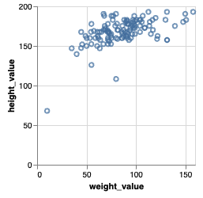
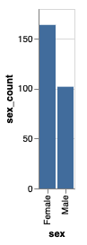
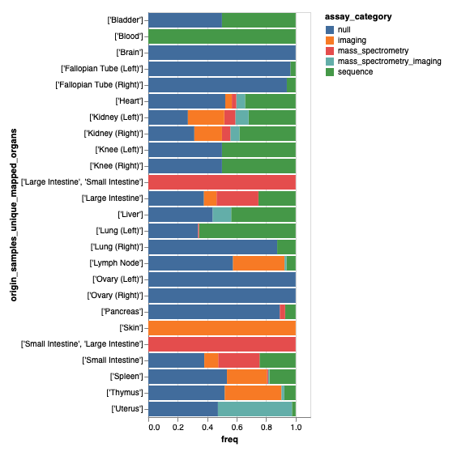
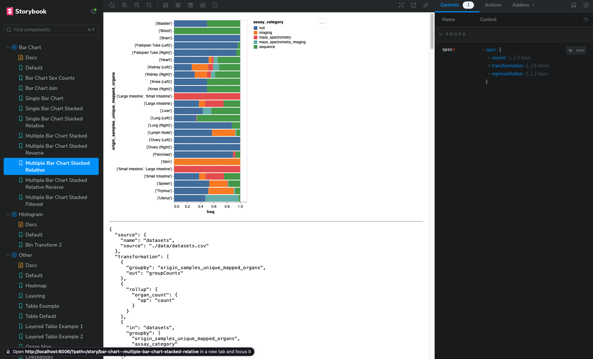

### Universal Discovery Interface Visualization Grammar

This repository contains the current type definitions for the Universal Discovery Interface (UDI) Grammar.

The Grammar is defined with TypeScript typings in [GrammarTypes.ts](./src/components/GrammarTypes.ts).

The Grammar maps variables to visual encodings. For instance, to create a scatterplot of height and weight we can map `height_value` to `x` and `weight_value` to `y` from the example `donors.csv` file.

```json
{
  "source": {
    "name": "donors",
    "source": "./data/donors.csv"
  },
  "representation": {
    "mark": "point",
    "mapping": [
      {
        "encoding": "y",
        "field": "height_value",
        "type": "quantitative"
      },
      {
        "encoding": "x",
        "field": "weight_value",
        "type": "quantitative"
      }
    ]
  }
}
```

Resulting in a visualization that would look like:



Scatterplots are easy since they map rows in data tables directly to marks. However, many visualizations first require transforming the data. For instance to create a bar chart showing the counts of donors faceted by sex requires a data transformation to calculated those counts.

```json
{
  "source": {
    "name": "donors",
    "source": "./data/donors.csv"
  },
  "transformation": [
    {
      "groupby": "sex"
    },
    {
      "rollup": {
        "sex_count": {
          "op": "count"
        }
      }
    }
  ],
  "representation": {
    "mark": "bar",
    "mapping": [
      {
        "encoding": "x",
        "field": "sex",
        "type": "nominal"
      },
      {
        "encoding": "y",
        "field": "sex_count",
        "type": "quantitative"
      }
    ]
  }
}
```



These data transformations can get more complex. For instance to create a relative stacked bar chart with multiple bars can be accomplished with this specification.

```json
{
  "source": {
    "name": "datasets",
    "source": "./data/datasets.csv"
  },
  "transformation": [
    {
      "groupby": "origin_samples_unique_mapped_organs",
      "out": "groupCounts"
    },
    {
      "rollup": {
        "organ_count": {
          "op": "count"
        }
      }
    },
    {
      "in": "datasets",
      "groupby": ["origin_samples_unique_mapped_organs", "assay_category"]
    },
    {
      "rollup": {
        "organ_assay_count": {
          "op": "count"
        }
      }
    },
    {
      "in": ["datasets", "groupCounts"],
      "join": "origin_samples_unique_mapped_organs",
      "out": "datasets"
    },
    {
      "derive": {
        "freq": "d.organ_assay_count / d.organ_count"
      }
    }
  ],
  "representation": {
    "mark": "bar",
    "mapping": [
      {
        "encoding": "x",
        "field": "freq",
        "type": "quantitative"
      },
      {
        "encoding": "y",
        "field": "origin_samples_unique_mapped_organs",
        "type": "nominal"
      },
      {
        "encoding": "color",
        "field": "assay_category",
        "type": "nominal"
      }
    ]
  }
}
```



## Using udi-toolkit

The `udi-toolkit` npm package (built from `src/components/`) renders UDI grammar specs as interactive visualizations. It supports three consumption modes:

### Vue

```bash
npm install udi-toolkit
```

```ts
import { UDIToolkit, UDIVis } from 'udi-toolkit';
import 'udi-toolkit/style.css';

// As a Vue plugin (registers components globally)
app.use(UDIToolkit);

// Or import the component directly
// <UDIVis :spec="spec" :selections="selections" @selection-change="onSelect" />
```

### Custom Element (any framework)

```bash
npm install udi-toolkit vega vega-lite vega-embed arquero ag-grid-community
```

```html
<script type="module">
  import 'udi-toolkit/ce';
</script>

<udi-vis id="chart"></udi-vis>

<script>
  document.getElementById('chart').spec = {
    source: { name: 'donors', source: './data/donors.csv' },
    representation: {
      mark: 'point',
      mapping: [
        { encoding: 'x', field: 'weight_value', type: 'quantitative' },
        { encoding: 'y', field: 'height_value', type: 'quantitative' },
      ],
    },
  };
</script>
```

### React

```bash
npm install udi-toolkit vega vega-lite vega-embed arquero ag-grid-community react
```

```tsx
import { UDIVis } from 'udi-toolkit/react';

function App() {
  return (
    <UDIVis
      spec={spec}
      selections={selections}
      onSelectionChange={setSelections}
    />
  );
}
```

### Headless data query (`queryData`)

`queryData` runs a UDI Grammar spec through the same Arquero pipeline that
`<UDIVis>` uses but returns the resulting rows instead of rendering a chart.
Useful for filtered counts, exports, or any UI that needs the data but
not the visualization. Results are memoized per
`(sources, transformations, active selections)` tuple so repeat queries
(e.g. brushing back to a previous range) serve from cache.

```ts
import { queryData } from 'udi-toolkit/react';

const result = await queryData(
  {
    source: { name: 'donors', source: '/data/donors.csv' },
    transformation: [{ rollup: { count: { op: 'count' } } }],
  },
  selections,
  { displayDataOnly: true }, // skip materializing the full unfiltered table
);
// result?.displayData → [{ count: 1234 }]
```

`displayDataOnly` controls whether the result includes a materialized
unfiltered `allData` table. When omitted, it defaults to `true` for
specs whose transformation ends with a rollup (the unfiltered aggregate
is rarely consumed) and `false` otherwise. For non-rollup specs that
only read `displayData` (e.g. exports), set it to `true` explicitly to
skip the expensive second pass.

The function is also exported from `udi-toolkit/ce` for non-React
consumers.

### Pre-loading data and computing domains (`loadDataPackage`)

`<UDIVis>` lazy-loads each CSV the first time a chart references it. If
your app already knows the full set of datasets up front (e.g. a data
package manifest), `loadDataPackage` fetches each URL once, parses it
on the main thread (so the parsed table is cached for `<UDIVis>` to
reuse — no re-fetch), and computes per-field domains in a dedicated
Web Worker. Domains stream back per entity as they finish:

```ts
import { loadDataPackage } from 'udi-toolkit/react';
import type { DataFieldDomain } from 'udi-toolkit/react';

const allDomains: DataFieldDomain[] = [];

await loadDataPackage(
  [
    { name: 'donors',   url: '/data/donors.csv'   },
    { name: 'samples',  url: '/data/samples.csv'  },
    { name: 'datasets', url: '/data/datasets.csv' },
  ],
  {
    onEntityDomains: (entityName, domains) => {
      allDomains.push(...domains);
    },
    onError: (entityName, message) => {
      console.error(`Failed to load ${entityName}: ${message}`);
    },
  },
);
// At this point every <UDIVis> referencing one of these entities by
// name will reuse the parsed table from the shared cache — no re-fetch.
```

Each `DataFieldDomain` has the shape:

```ts
interface DataFieldDomain {
  entity: string;
  field: string;
  type: 'interval' | 'point';
  domain: { min: number; max: number } | { values: string[] };
  fieldDescription: string;
}
```

`loadDataPackage` falls back to a main-thread compute path if Worker
construction throws (e.g. restrictive CSP). The same function and
types are exported from `udi-toolkit/ce` for non-React consumers.

### Reacting to selections without re-rendering (`subscribeToSelections`)

All selections — both Vega brushes (written directly by `<UDIVis>`'s
signal handlers) and external filters bound via `queryData`'s
`selections` argument — live in a single shared Pinia `DataSourcesStore`.
Brush events fire at up to 60 Hz; mirroring them into a React store just
to trigger an effect causes pointless re-renders. `subscribeToSelections`
exposes the Pinia change feed directly:

```ts
import { subscribeToSelections, clearAllSelections } from 'udi-toolkit/react';

useEffect(() => {
  let unsubscribe: (() => void) | null = null;
  let cancelled = false;
  subscribeToSelections(() => {
    // fires on every selection change — brush ticks AND programmatic updates
    triggerMyQueryPump();
  }).then((u) => {
    if (cancelled) u();
    else unsubscribe = u;
  });
  return () => {
    cancelled = true;
    unsubscribe?.();
  };
}, []);
```

The returned unsubscribe is wrapped in a promise because `ce-entry` (and
the shared Pinia singleton) lazy-load on first udi-toolkit call; the
callback fires synchronously once subscribed.

`clearAllSelections()` wipes every active selection — useful for
"reset session" flows so stale bookkeeping entries from closed
visualizations don't accumulate across resets. Brushes themselves are
already cleared by Vega when a chart unmounts.

Both functions are also exported from `udi-toolkit/ce` for non-React
consumers — they return a synchronous unsubscribe / `void` there since
ce-entry is already imported.

### Building the library

```bash
cd src/components
yarn build:all    # Builds Vue, Custom Element, and React targets
yarn test         # Builds + runs smoke tests
```

## Quick start for developers

1.  **Clone the repository.**

    ```shell
    git clone https://github.com/hms-dbmi/udi-grammar
    ```

1.  **Install the dependencies.**

    ```shell
    # Navigate to the directory
      cd udi-grammar

    # Install the dependencies
    yarn
    ```

1.  **Browse your stories with storybook.**

    UDI-Grammar uses [storybook](https://storybook.js.org/) to test the grammar with individual stories.

    Run `yarn storybook` to see stories at `http://localhost:6006`

    

1.  **Run the code editor with Quasar in development mode.**

```bash
quasar dev
```

### Build the code editor application for production

```bash
quasar build
```
